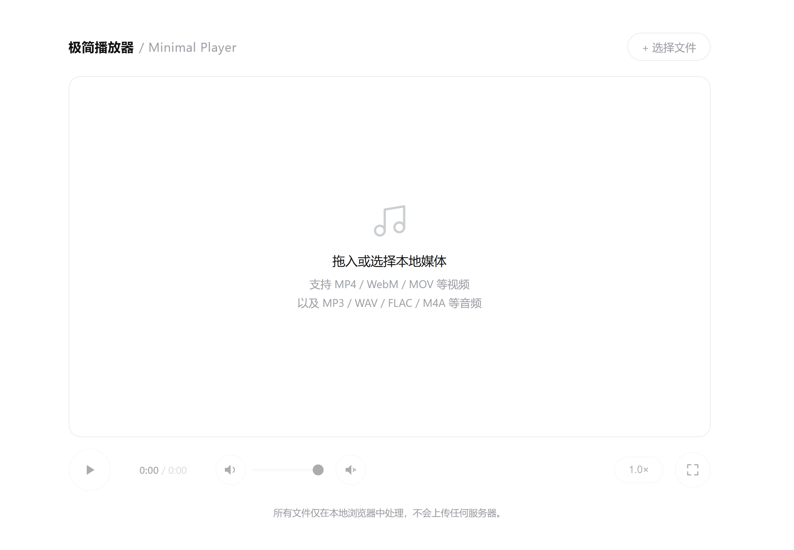

[English](README.md) | [简体中文](README_Simplified_Chinese.md) | [繁體中文](README_Classical_Chinese.md)

此乃一功能俱全、形制簡約之**本機影音播放器**，純以 HTML 為之，運行於瀏覽器中，無需後端。

---

## 一、總體架構與技術
- **純前端**：單頁 HTML，內嵌 CSS 與 JavaScript，無外賴。
- **媒體處理**：藉 `<video>` 與 Web Audio API 以行播放、即時音頻分析與增益之控。
- **繪製與動畫**：以 Canvas 作波形圖與柱狀頻譜，藉 `requestAnimationFrame` 驅動即時之視覺。
- **響應式設計**：適於移動端，用 `aspect-ratio` 與彈性佈局。

---

## 二、核心功能
- **本機檔案載入**
  - 可點「選擇檔案」，或拖曳檔案至播放之域。
  - 自辨影像（MP4、WebM、MOV）與音頻（MP3、WAV、FLAC、M4A）。
  - 檔案唯於本機處理，不傳於伺服器。
- **播放之控**
  - 播放／暫停（點中央之域或按鈕）。
  - 進度之示（當前時／總時長）。
  - 進度跳躍：點波形圖任意處，可定位其時。
- **音量之管**
  - 滑桿以調音量（0~1）。
  - 一鍵靜音；靜音則自隱音量滑桿與增益之控（以簡其界面）。
- **播放之速**
  - 預設速度：0.5×、0.75×、1.0×、1.25×、1.5×、2.0×、3.0×。
  - 點按鈕則出選單，點外則自闔。
- **全屏之式**
  - 可全屏播影像（舞臺之域全屏）；全屏則隱圓角、調縱橫之比。

---

## 三、交互之驗
- **視覺之反饋**
  - 拖曳時示虛線之框以為提示。
  - 播放之鈕，點之則有縮放之動（`pop` 關鍵幀）。
  - 狀態之易（播放／暫停、增益之關、限制之關），以鈕式之變（`on` 類）與圖識別之。
- **控件之分組與斂**
  - 「音量增益」之板，默然斂之；點增益之關則展，內有倍率之滑桿（1~10 倍）與限制之關。
  - 板之展斂，有 `max-height` 之緩動。
- **無礙**：用語義之標，輸入之控皆附 `title` 之示。

---

## 四、視覺之具
### （一）音頻波形圖（`#wave` Canvas）
- **算**：載檔後，以 `AudioContext.decodeAudioData` 解音頻，取左聲道峰值（百六十點），歸一而存為 `peaks`。
- **繪**：用圓角之方條；已播者（依當前進度）填深，未播者淡灰，以明其處。
- **相**：點波形圖，可躍至其時。

### （二）即時頻譜（`#spectrum` Canvas）
- **觸**：唯**音頻**播時乃動（影像不示頻譜，唯示其畫）。
- **源**：藉 `AnalyserNode` 取頻域之數（FFT 為 256，凡百二十八點）。
- **繪之法**：
  - 用平潤之算（升速降緩）以抑顫，成穩之柱圖。
  - 播時即時更之；暫停或終則退為靜之微波。
- **效**：由 `requestAnimationFrame` 驅之；閒則罷其循環以省資。

---

## 五、音頻之處（增益與限制）
為增益（至高十倍）而防削波之失真，築全鏈如左：
```
MediaElementSource → GainNode → DynamicsCompressor（限制） → AnalyserNode → AudioContext.destination
```
- **增益之點**（`gainNode`）：依 `boostOn` 之態與 `boost` 滑桿之值以動增益（默關則增益為一）。
- **限制器**（`DynamicsCompressor`）：閾 -6 dB，比 20:1，軟拐為零，起／釋 3 ms / 250 ms，善用以防大信之過載。
- **旁路之便**：限制可開闔；闔則增益直連分析器，以順人之所好。
- **用其時**：音頻之境，初播乃緩啟（`ensureAudioGraph`），以兼容而不費資。

---

## 六、其餘細節
- **容錯**：音頻解之敗（如某些影像之器），波形不示，然播不受妨。
- **自適之繪**：窗變則自調 Canvas 之幅（慮 `devicePixelRatio` 以清）。
- **全屏之適**：全屏則去圓角之框，影像滿舞臺。
- **檔息之示**：示檔名、類（影像／音頻）與格式之綴。

---
## 項目截圖


---
### 許可證

[MIT](LICENSE)
